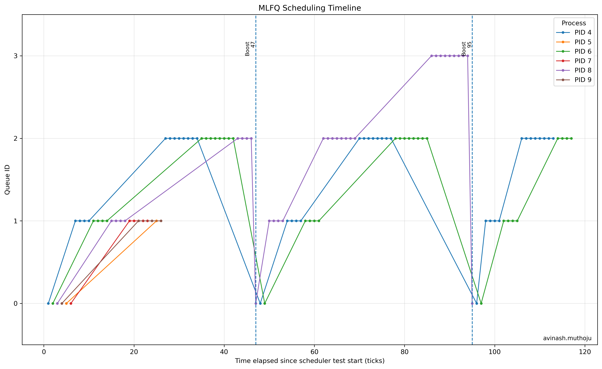

## MLFQ Implementation, Analysis and Scheduler Comparison

# 2.2 Cross-Scheduler Comparison

The three schedulers were evaluated using the same six-child workload. The measured process metrics were used to calculate average turnaround time, average waiting time, and average response time.

| Scheduler | Avg. Turnaround (ticks) | Avg. Waiting (ticks) | Avg. Response (ticks) |
|---|---:|---:|---:|
| FIFO | 49.17 | 35.67 | 1.50 |
| RR | 55.17 | 41.17 | 1.50 |
| MLFQ | 57.50 | 42.50 | 1.50 |

## Discussion

For the fixed workload used in the experiment, FIFO produced the lowest average turnaround time (49.17 ticks) and waiting time (35.67 ticks). Round Robin produced slightly higher averages of 55.17 ticks for turnaround and 41.17 ticks for waiting, while MLFQ produced 57.50 ticks and 42.50 ticks respectively.

The similar average response time of 1.50 ticks for all three schedulers is due to the fact that the six child processes are created close together and the workload is relatively small.

FIFO benefits from avoiding repeated time-slice preemptions, but a long CPU-bound process can delay processes behind it. RR improves fairness by repeatedly sharing the CPU among runnable processes, although this introduces additional scheduling activity and can increase waiting and turnaround times.

MLFQ prioritizes short CPU bursts and gradually demotes CPU-bound processes, while its periodic priority boost prevents starvation. However, for this particular workload, these mechanisms do not produce lower average metrics than FIFO.

Therefore, the measured results demonstrate that scheduler performance depends strongly on the workload characteristics and the scheduling policy's overhead.

---

# 2.3.1 Implementation Summary

## Makefile / Scheduler Selection

The Makefile was modified to select the scheduler at compile time using the `SCHEDULER` variable.

- `SCHEDULER=MLFQ` enables the MLFQ implementation through the `MLFQ` macro.
- `SCHEDULER=FIFO` enables FIFO through the `FIFO` macro.
- When no scheduler is specified, the original xv6 Round Robin scheduler is retained.

Example:

make clean
make SCHEDULER=MLFQ 

## `struct proc`

The `struct proc` structure was extended with:

- `priority`
- `ticks_used`
- `next`

These fields are used for MLFQ queue management.

Additional timing fields were added:

- `arrival_tick`
- `first_run_tick`
- `completion_tick`
- `waiting_ticks`

These fields are used to measure turnaround, response, and waiting times.

## `allocproc()`

`allocproc()` initializes every newly allocated process to priority queue Q0 and clears its time-slice counter.

It also records the process arrival tick and initializes the timing fields used for scheduler comparison.

## Queue Selection and Preemption

The MLFQ scheduler maintains four FIFO queues:

```text
Q0 → Highest priority
Q1
Q2
Q3 → Lowest priority
```

The scheduler always selects a process from the highest non-empty queue.

A running lower-priority process gives up the CPU when a higher-priority runnable process becomes available.

## Time Slices

The MLFQ time slices are:

| Queue | Time Slice |
|---|---:|
| Q0 | 1 tick |
| Q1 | 4 ticks |
| Q2 | 8 ticks |
| Q3 | 16 ticks |

A process that consumes its complete time slice is demoted by one queue.

A process already in Q3 remains in Q3.

## Voluntary Yield

When a process voluntarily yields the CPU before its time slice expires, its priority is preserved.

It is inserted at the tail of its current queue rather than being demoted.

This allows short or interactive processes to maintain higher priority.

## Priority Boosting

A periodic priority boost occurs every 48 ticks.

Runnable processes in Q1, Q2, and Q3 are moved to Q0 and their time-slice counters are reset.

The running process is also assigned priority Q0.

This prevents starvation of lower-priority processes.

## `procdump()`

`procdump()` was extended to display:

- Process priority queue
- Number of ticks consumed in the current time slice
- Accumulated running time

This makes the scheduler state observable during testing and debugging.

---

# 2.3.2 MLFQ Analysis

The custom `schedulertest` creates six child processes.

Even-indexed children perform CPU-intensive work without voluntarily yielding, while odd-indexed children perform shorter CPU bursts and call `yield()`.

This creates both CPU-bound and voluntarily yielding behavior so that the MLFQ policy can be observed.

## MLFQ Configuration

| Queue | Priority | Time Slice |
|---|---|---:|
| Q0 | Highest | 1 tick |
| Q1 | High | 4 ticks |
| Q2 | Low | 8 ticks |
| Q3 | Lowest | 16 ticks |

## MLFQ Scheduling Timeline



**Figure 1:** MLFQ scheduling timeline showing the movement of processes across queues Q0–Q3. CPU-bound processes are progressively demoted as they consume their time slices, while the periodic 48-tick priority boosts return active processes to Q0.

The graph uses global tick **1249** as the beginning of the scheduler-test workload. Therefore, the actual global priority boosts at ticks **1296** and **1344** appear at elapsed ticks **47** and **95**, respectively.

## Observed Queue Movement

The MLFQ timeline shows processes moving between Q0, Q1, Q2, and Q3 according to their CPU usage.

CPU-bound processes that repeatedly consume their complete time slices are gradually demoted toward Q3, while processes that voluntarily yield before exhausting their time slice remain at their current priority.

The strict-priority policy allows processes in higher queues to receive the CPU before processes in lower queues.

The periodic 48-tick priority boost moves active processes back to Q0, preventing starvation and allowing processes in lower queues to receive CPU time again.

## Important Observations from the Trace

- All six test children arrive at global tick **1249**.
- The initial executions occur in **Q0**.
- Processes consuming their complete Q0 slice move to **Q1**.
- Long CPU-bound executions then move from Q1 to Q2.
- PID 8 reaches **Q3**, demonstrating progressive demotion.
- The first actual global boost occurs at tick **1296**, which is elapsed tick **47** relative to the test start.
- The second actual global boost occurs at tick **1344**, which is elapsed tick **95**.
- PID 8 is observed in Q3 immediately before the second boost and in Q0 at tick 1344, demonstrating the boost behavior.

---

# 2.3.3 Comparison Results and Trade-offs

The final measured comparison is:

| Scheduler | Average Turnaround | Average Waiting | Average Response |
|---|---:|---:|---:|
| FIFO | 49.17 | 35.67 | 1.50 |
| RR | 55.17 | 41.17 | 1.50 |
| MLFQ | 57.50 | 42.50 | 1.50 |

## Trade-off Discussion

1. FIFO produced the best measured average turnaround and waiting times for this particular workload.

2. RR provides fairer sharing of the CPU because runnable processes receive repeated time slices, but this can increase scheduling activity and waiting/turnaround.

3. MLFQ favors interactive or short-burst processes by keeping them at higher priority and demoting CPU-bound processes.

4. The 48-tick priority boost is important because it prevents processes that have reached low-priority queues from being starved indefinitely.

5. MLFQ is more adaptive than FIFO or basic RR, but the additional queue management, preemption and boosting mechanisms do not guarantee the lowest averages for every workload.

6. All three schedulers measured the same average response time of 1.50 ticks in this experiment because the six children arrive close together and the workload is relatively small.

---

# MLFQ `schedulertest`

```c
#include "kernel/types.h"
#include "kernel/stat.h"
#include "user/user.h"

#define NCHILDREN 6

static void
cpu_burn(int loops)
{
  volatile long x = 0;

  for(int i = 0; i < loops; i++)
    x += i;
}

int
main(int argc, char *argv[])
{
  printf("schedulertest: spawning %d children\n", NCHILDREN);

  for(int i = 0; i < NCHILDREN; i++){
    int pid = fork();

    if(pid < 0){
      printf("schedulertest: fork failed\n");
      exit(1);
    }

    if(pid == 0){
      if(i % 2 == 0){
        for(int r = 0; r < 30; r++){
          cpu_burn(40000000);
        }
      }
      else{
        for(int r = 0; r < 30; r++){
          cpu_burn(5000000);
          yield();
        }
      }

      exit(0);
    }
  }

  for(int i = 0; i < NCHILDREN; i++){
    int status;
    int pid = wait(&status);

    printf("schedulertest: child pid=%d finished\n", pid);
  }

  printf("schedulertest: done\n");
  exit(0);
}
```

# MLFQ Plotting Script

```python
import re
import matplotlib.pyplot as plt

data = []

with open("mlfq_trace.txt", "r") as f:
    for line in f:
        match = re.search(
            r"TRACE tick=(\d+) pid=(\d+) q=(\d+)",
            line
        )

        if match:
            tick = int(match.group(1))
            pid = int(match.group(2))
            queue = int(match.group(3))

            data.append((tick, pid, queue))

if not data:
    print("ERROR: No MLFQ trace data found.")
    print("Make sure mlfq_trace.txt contains lines like:")
    print("TRACE tick=1250 pid=4 q=0")
    exit()
start_tick = 1249

elapsed_data = [
    (tick - start_tick, pid, queue)
    for tick, pid, queue in data
]

pids = sorted(
    set(pid for tick, pid, queue in elapsed_data)
)

plt.figure(figsize=(13, 8))

for pid in pids:

    x = []
    y = []

    for tick, process, queue in elapsed_data:

        if process == pid:
            x.append(tick)
            y.append(queue)
    plt.plot(
        x,
        y,
        marker="o",
        markersize=3,
        linewidth=1.2,
        label=f"PID {pid}"
    )

max_elapsed = max(
    tick for tick, pid, queue in elapsed_data
)

first_boost = ((start_tick // 48) + 1) * 48

for global_tick in range(
    first_boost,
    start_tick + max_elapsed + 1,
    48
):

    elapsed = global_tick - start_tick

    plt.axvline(
        x=elapsed,
        linestyle="--",
        linewidth=1.2
    )

    plt.text(
        elapsed,
        3.18,
        f"Boost\n{elapsed}",
        rotation=90,
        verticalalignment="top",
        horizontalalignment="right",
        fontsize=8
    )
plt.xlabel(
    "Time elapsed since scheduler test start (ticks)"
)
plt.ylabel("Queue ID")
plt.yticks([0, 1, 2, 3])
plt.ylim(-0.5, 3.5)
plt.title(
    "MLFQ Scheduling Timeline"
)
plt.grid(
    True,
    alpha=0.3
)
plt.legend(
    title="Process",
    loc="upper right"
)
plt.text(
    0.99,
    0.01,
    "avinash.muthoju",
    transform=plt.gca().transAxes,
    horizontalalignment="right",
    verticalalignment="bottom",
    fontsize=9
)
plt.tight_layout()

plt.savefig(
    "mlfq_timeline.png",
    dpi=300,
    bbox_inches="tight"
)
plt.show()

print("Plot generated successfully:")
print("mlfq_timeline.png")
```

---

# MLFQ Trace Metrics

The final supplied MLFQ trace produced the following process-level results:

| PID | Arrival | First Run | Completion | Waiting | Turnaround | Response |
|---:|---:|---:|---:|---:|---:|---:|
| 5 | 1249 | 1250 | 1275 | 24 | 26 | 1 |
| 9 | 1249 | 1252 | 1275 | 22 | 26 | 3 |
| 7 | 1249 | 1251 | 1298 | 44 | 49 | 2 |
| 8 | 1249 | 1251 | 1346 | 65 | 97 | 2 |
| 6 | 1249 | 1250 | 1366 | 82 | 117 | 1 |
| 4 | 1249 | 1249 | 1366 | 78 | 117 | 0 |

### MLFQ averages

```text
Average turnaround = 57.50 ticks
Average waiting    = 42.50 ticks
Average response   = 1.50 ticks
```

---

# Conclusion

The implemented MLFQ scheduler uses four priority queues with increasing time slices from Q0 to Q3. Processes that consume their entire time slice are progressively demoted, while voluntary yielding preserves their current priority. A global priority boost every 48 ticks returns active processes to Q0 and prevents starvation.

The scheduler trace confirms the expected queue movement and boost behavior. For the fixed six-process workload, FIFO achieved the lowest average turnaround and waiting times, while all three schedulers had the same measured average response time. These results illustrate that no single scheduling policy is optimal for every workload: FIFO can perform well for this particular workload, RR emphasizes fairness, and MLFQ adapts priority based on CPU behavior while providing starvation prevention.
